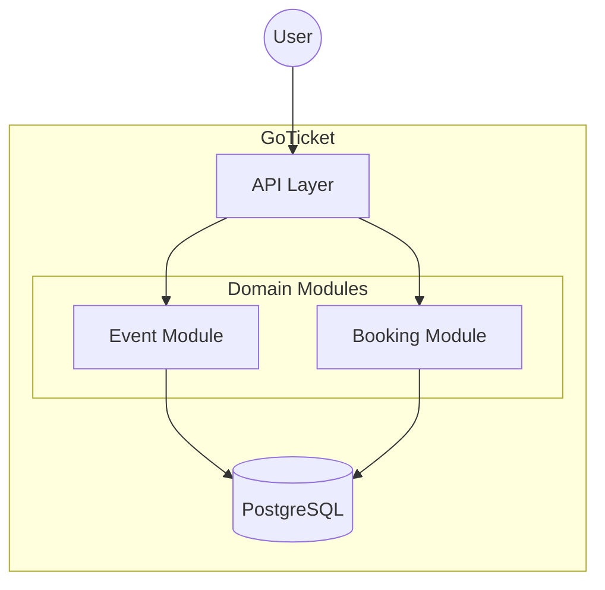

<div align="center">

[](https://git.io/typing-svg)

**10+ Years Engineering Experience** | **Mechanical → Software** | 🇵🇱 🇬🇧 🇸🇪

[](https://www.linkedin.com/in/mateusz-urbaniak-133001117/)
[](mailto:mateusz.urbaniak@example.com)

</div>

---

## 🚀 About Me

```yaml
experience:
  total: "10+ years"
  mechanical_engineer: "6 years"
  software_engineer: "4.5 years @ Accenture Poland"
  
current_role: "Frontend Engineer expanding to Fullstack"
location: "Poland"

languages:
  polish: "Native"
  english: "Fluent"
  swedish: "Conversational"

background: |
  Built a foundation in Mechanical Engineering through formal studies, then transitioned into Software Engineering,
  applying 6 years of systems thinking to 4.5 years of professional software development at Accenture.


mentoring: |
  Former mentor at devmentor.pl (Frontend), helping junior developers 
  level up their skills through code reviews and pair programming.

code_review: "Daily practice with team members - strict standards, constructive feedback"
```

---

## 🔥 Featured Project

### [GoTicket](https://github.com/mati99789/go-ticket) - Event Ticketing System

> High-performance, scalable ticketing system built in Go. From Modular Monolith to Microservices.

<div align="center">


</div>

## 🏆 Achievements

- 95% test coverage in GoTicket  
- 200 concurrent booking tests passed without race conditions  
- Mentored junior developers at devmentor.pl  

**Architecture:** Clean Architecture (DDD) | **Concurrency:** 200 goroutines tested | **Coverage:** 95%



**Key Highlights:**
- ✅ **Zero Race Conditions** - Verified with 200 concurrent booking attempts
- ✅ **Atomic Reservations** - PostgreSQL row-level locking prevents double-booking
- ✅ **Type-Safe SQL** - `sqlc` generates compile-time verified queries
- ✅ **Real Integration Tests** - Testcontainers with actual Postgres, not mocks
- ✅ **Production-Ready** - Graceful shutdown, structured logging, strict linting
- ✅ **Clean Architecture** - Domain logic completely isolated from infrastructure

**What I Learned:**
- Domain-Driven Design in practice
- Go concurrency patterns (`sync/atomic`, `WaitGroups`)
- Database transaction isolation
- Race condition detection & prevention
- Repository pattern with testable abstractions

---

## 📚 What I'm Reading

> *"The reading of all good books is like conversation with the finest minds of past centuries."* — René Descartes

| Book | Author | Why It Matters |
|------|--------|----------------|
| **Designing Data-Intensive Applications** | Martin Kleppmann | The bible for backend engineers - understanding trade-offs in distributed systems |
| **Clean Architecture** | Robert C. Martin | Applying SOLID principles in GoTicket's layered architecture |
| **The Go Programming Language** | Donovan & Kernighan | Deep dive into Go's runtime, memory model, and idioms |
| **System Design Interview** | Alex Xu | Preparing for large-scale system challenges |

---

## 🧠 How I Work

### Not Vibe Coding: AI as Learning Accelerator

I use AI tools to **accelerate understanding**, not to skip it:

```
❌ "Generate me a booking system in Go"
✅ "Explain the trade-offs between optimistic and pessimistic locking 
    in PostgreSQL for high-concurrency ticket reservations"
```

**My AI Workflow:**
1. **Architecture Research** - "What are the patterns for handling concurrent reservations?"
2. **Deep Dives** - "Explain Go's memory model and happens-before relationships"
3. **Documentation** - "How does pgxpool implement connection pooling under the hood?"
4. **Code Review** - "What are potential race conditions in this code?"

**The Rule:** Every line of code must be justified. I don't copy-paste; I understand, adapt, and own the solution.

### Engineering Principles

- **"Why?" over "How?"** - Every technical decision must have a reason (why `pgx` over `database/sql`?)
- **No Framework Magic** - Using `net/http` instead of Gin/Fiber to understand HTTP under the hood
- **Production-First Mindset** - Graceful shutdown, observability, and error handling from day one
- **Test-Driven Confidence** - Real integration tests with containers, not mocks

---

## 💻 Tech Stack

### Frontend (4.5 Years Production Experience)


### Backend (Growing Portfolio)


### DevOps & Tools


---
## 📊 GitHub Stats

<div align="center">
  
</div>


## 🚀 Other Projects

<div align="center">

### Comming soon


</div>

---

## 🎯 6-Month Learning Roadmap

```
Q1 2026:
├── AWS Solutions Architect certification
├── Kubernetes fundamentals
└── Terraform/OpenTofu for IaC

Q2 2026:
├── Advanced System Design
├── Kafka/RabbitMQ (event-driven architecture)
└── Production deployment of GoTicket to AWS
```


## 🤝 Let's Connect

<div align="center">

I'm always open to discussions about:

- System design & architecture  
- Go best practices  
- Frontend performance  
- AI-assisted engineering  

[](https://www.linkedin.com/in/mateusz-urbaniak-133001117/)  
[](mailto:matteus.urbaniak@hotmail.com)  
[](https://github.com/mati99789)

<br/>

**Built with ❤️ and strict engineering principles**

> *"From mechanical systems to software systems — the principles of good engineering remain the same."*

</div>

